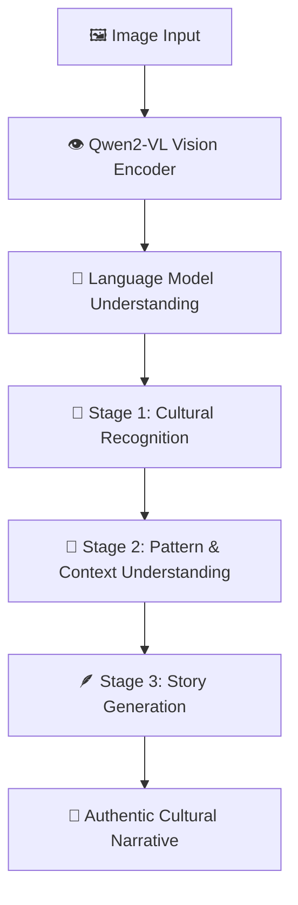

# 💻 MuseForge  
> *Where Artificial Intelligence forges stories, heritage, and human creativity into digital form.*

---

<div align="center">


**An intelligent AI system that “sees” cultural artifacts and forges authentic stories reflecting the essence of human heritage.**

[🚀 Quick Start](#-quick-start) • [📊 Highlights](#-project-highlights) • [🏗️ Architecture](#-technical-architecture) • [🧠 Dataset](#-dataset-format) • [🤝 Contributing](#-contributing) • [📜 License](#-license)

</div>

---

## 🌟 Overview  

**MuseForge** is an advanced AI framework that combines *machine perception* and *creative storytelling* to bring cultural and visual data to life.  
By uniting **Vision-Language Models (VLMs)** and **progressive learning**, it transforms silent imagery — temples, monuments, attire, and art — into rich, context-aware narratives that preserve cultural depth and authenticity.

It acts as a *digital forge*, shaping **pixels into prose** and **data into meaning.**

---

## 🧠 Core Philosophy  

- **🔍 Perception:** Empowering AI to see and recognize cultural depth in imagery.  
- **🧩 Interpretation:** Understanding regional context and artistic nuance.  
- **🪶 Creation:** Generating authentic, human-like cultural stories with AI.

---

## 📊 Project Highlights  

<div align="center">

| Feature | Description |  
|----------|--------------|  
| 🧠 **AI Core** | Vision-Language Model (Qwen2-VL, 2B parameters) fine-tuned via LoRA for cultural storytelling. |  
| 🧱 **3-Stage Training Pipeline** | Recognition → Comprehension → Story Generation — progressive fine-tuning for semantic depth. |  
| 🎨 **Cultural Intelligence** | Detects regional and artistic attributes to create authentic heritage narratives. |  
| ⚙️ **Model Efficiency** | 85% reduction in loss (130 → 19.7) with LoRA + quantization. |  
| 🔍 **Explainability** | Traceable mapping between visual features and generated text. |  
| 🌍 **Impact** | Aids digital preservation of heritage through AI-driven storytelling. |  

</div>

---

## 🏗️ Technical Architecture  



---

## ⚡ Training Configuration  

| Parameter | Value |  
|------------|--------|  
| **Base Model** | Qwen2-VL-2B-Instruct |  
| **Fine-tuning** | LoRA (r=8, α=32) |  
| **Precision** | 4-bit Quantization (bfloat16) |  
| **Optimizer** | AdamW + Cosine Scheduler |  
| **Context Length** | 512 tokens |  
| **Training Time** | ~3–5 hours (8GB GPU) |  

---

## 📁 Repository Structure  

```bash
MuseForge/
├── 🧠 train_pipeline.py        # Main 3-stage training pipeline
├── 🔮 inference.py             # Story generation module
├── 🧩 dataset_utils.py         # Dataset processing & augmentation
├── ⚙️ config.py                # Configurations and hyperparameters
├── 📊 evaluation_metrics.py    # Narrative accuracy evaluation
├── 📋 requirements.txt         # Dependencies
├── 📁 data/                    # Dataset directory
│   └── cultural_dataset.json   # JSON-formatted dataset
├── 📁 models/                  # Model checkpoints
│   └── museforge_vlm_model/    # Trained model folder
├── 📁 examples/                # Example inputs & outputs
│   ├── input_image.jpg
│   └── generated_story.txt
└── 📖 README.md
```

---

## 🚀 Quick Start  

### 1️⃣ Installation  

```bash
git clone https://github.com/meanderinghuman/MuseForge.git
cd MuseForge
pip install -r requirements.txt
pip install torch torchvision transformers[vision] peft accelerate bitsandbytes
```

---

### 2️⃣ Usage  

```python
from inference import MuseForgeModel

model = MuseForgeModel("./models/museforge_vlm_model")
story = model.generate_story("examples/input_image.jpg")
print(story)
```

**Example Output:**
```
This timeless South Indian temple, adorned with intricate carvings and a towering gopuram, 
echoes centuries of devotion and craftsmanship — a living narrative of culture forged in stone.
```

---

### 3️⃣ Train Your Own Model  

```bash
# Run full progressive training
python train_pipeline.py

# Test with smaller samples
python train_pipeline.py --test_samples 100

# Single stage training (optional)
python train_pipeline.py --single_stage
```

---

## 🧠 Dataset Format  

MuseForge expects datasets in this JSON structure:  

```json
{
  "image_path": "regional_images/South_India/temple_001.jpg",
  "region": "South_India",
  "metadata": {
    "elements": ["temple", "gopuram", "sculpture"],
    "architecture": {"style": "Dravidian"}
  },
  "context_story": "This ancient temple stands as a testament to South Indian art and devotion."
}
```

---

## 🌍 Regional Dataset Distribution  

| Region | Samples | Focus |  
|---------|----------|----------------|  
| 🏔️ **North India** | 160 | Temples, monuments |  
| 🏛️ **South India** | 200 | Dravidian architecture |  
| 🎭 **East India** | 200 | Colonial heritage |  
| 🏜️ **West India** | 200 | Stepwells, forts |  
| 🌄 **Northeast India** | 200 | Tribal and ecological art |  

---

## 🔬 Research Impact  

MuseForge contributes to **AI-driven cultural preservation**, bridging technology with tradition.  
It can serve as a **research framework** for:
- Vision-language grounding tasks  
- Cross-cultural narrative synthesis  
- Heritage digitization and multimodal learning  

---

## 🤝 Contributing  

We welcome contributions from AI researchers, developers, and cultural experts!  

1. 🍴 Fork the repository  
2. 🌿 Create a branch: `git checkout -b feature/your-feature`  
3. 💾 Commit: `git commit -m 'Added feature'`  
4. 📤 Push: `git push origin feature/your-feature`  
5. 🔀 Submit a Pull Request  

**Areas to contribute:**  
- Dataset expansion (regional or artifact-level)  
- Model architecture improvements  
- Multilingual or cross-cultural story support  
- UI or demo app integrations  

---

## 📜 License  

This project is licensed under the **MIT License** — you are free to use, modify, and distribute the software with attribution.  

```
MIT License

Copyright (c) 2025 Siddharth Pal

Permission is hereby granted, free of charge, to any person obtaining a copy
of this software and associated documentation files (the “Software”), to deal
in the Software without restriction...
```

---

## 🙏 Acknowledgments  

- **Qwen Team** — for the Qwen2-VL Vision-Language model  
- **Open Source AI Community** — for enabling multimodal research and tools  
- **Cultural Heritage Scholars** — for inspiring the integration of tradition and technology  

---

<div align="center">

⭐ *If MuseForge inspired you — consider starring this repository to support open cultural AI research.*  

</div>
